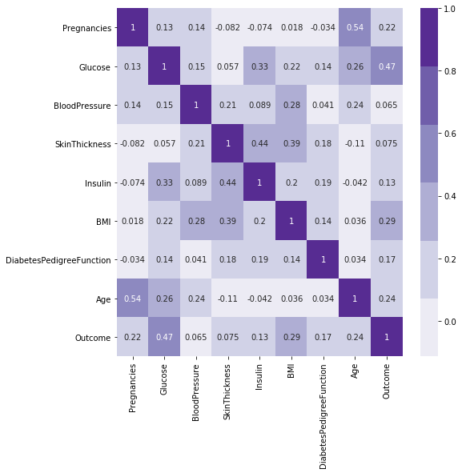
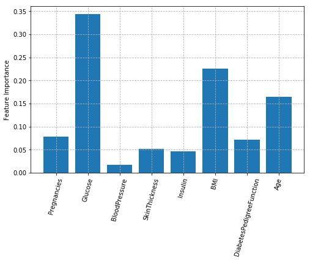
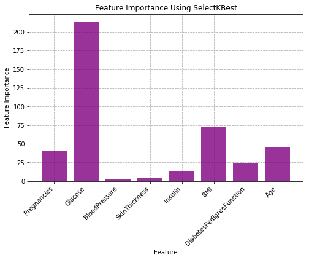
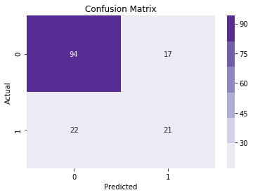
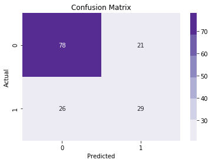
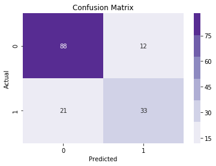
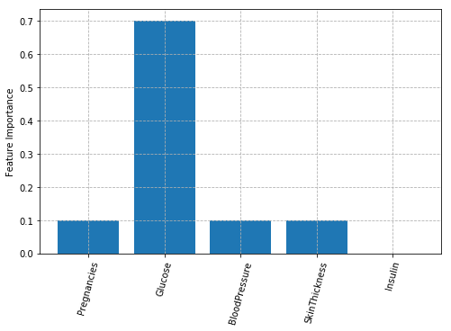
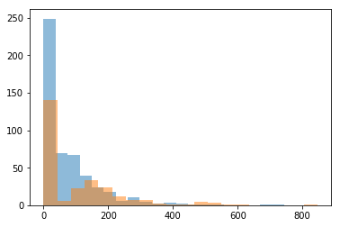

### Ensemble Methods Section 35

### Questions

### Objectives
YWBAT
- Compare and contrast decision trees with Random Forest Models
- Compare and contrast ADABoost with Gradient Boosting
- Condition our data for a single model
- Tune hyperparameters to increase desired metric
- Analyze model for use case
- Build a pipeline that will analyze an individual patient

### What is a random forest?
A random forest is a collection of decision trees where each decision tree is built by:
    - randomly sampling features of our data
    - randomly sampling data to train on
    - Bootstrap sample our data to train


How are points classified in a random forest?
- The point drops into every decision of our forest until
- The point then gets classified by every tree
- Majority vote on classification to classify our point


### Real Life Structures
- Forests with 20, 100, 1000 trees
- Tree Depth - 5 layers, 10 layers, 20 layers, etc


### Analyze 

### Adaboosting - sampling
- Steps to perform Adaptive Boosting
    - 0: Trains on training data
    - 1: Split Train Data in/out 70/30
        - The first split is truly random
    - 2: Build stump on in sample (70%)
    - 3: calculate error on out of bag of sample
    - 4a: Increase weights of out of bag samples that are incorrect
    - 4b: Decrease weights of out of bag samples that are correct
    - 5: Build next stump
    - Repeat 1 - 5
    - Aggregate voting 
    
    


### Gradient boosting - residuals
- How does this work for linreg/logistic? 
    - Minimizes the loss function by taking steps
        - Taking steps on our Loss_Function as a function of our coefficients (parameters)
- But Tree models are non parametric
    - 


### to use XGBOOST use
```import os
os.environ['KMP_DUPLICATE_LIB_OK']='True'```

### Outline


```python
import pandas as pd
import numpy as np

from sklearn.ensemble import RandomForestClassifier, AdaBoostClassifier, GradientBoostingClassifier
from sklearn.model_selection import train_test_split
from sklearn.feature_selection import SelectKBest
from sklearn.metrics import confusion_matrix, classification_report
from sklearn.preprocessing import StandardScaler

from mlxtend.feature_selection import SequentialFeatureSelector as sfs

import matplotlib.pyplot as plt
import seaborn as sns

np.random.seed(42)
```

### Let's build some models


```python
df = pd.read_csv("./pima-indians-diabetes.csv")
df.head()
```


<div>
<style scoped>
    .dataframe tbody tr th:only-of-type {
        vertical-align: middle;
    }

    .dataframe tbody tr th {
        vertical-align: top;
    }

    .dataframe thead th {
        text-align: right;
    }
</style>
<table border="1" class="dataframe">
  <thead>
    <tr style="text-align: right;">
      <th></th>
      <th>Pregnancies</th>
      <th>Glucose</th>
      <th>BloodPressure</th>
      <th>SkinThickness</th>
      <th>Insulin</th>
      <th>BMI</th>
      <th>DiabetesPedigreeFunction</th>
      <th>Age</th>
      <th>Outcome</th>
    </tr>
  </thead>
  <tbody>
    <tr>
      <th>0</th>
      <td>6</td>
      <td>148</td>
      <td>72</td>
      <td>35</td>
      <td>0</td>
      <td>33.6</td>
      <td>0.627</td>
      <td>50</td>
      <td>1</td>
    </tr>
    <tr>
      <th>1</th>
      <td>1</td>
      <td>85</td>
      <td>66</td>
      <td>29</td>
      <td>0</td>
      <td>26.6</td>
      <td>0.351</td>
      <td>31</td>
      <td>0</td>
    </tr>
    <tr>
      <th>2</th>
      <td>8</td>
      <td>183</td>
      <td>64</td>
      <td>0</td>
      <td>0</td>
      <td>23.3</td>
      <td>0.672</td>
      <td>32</td>
      <td>1</td>
    </tr>
    <tr>
      <th>3</th>
      <td>1</td>
      <td>89</td>
      <td>66</td>
      <td>23</td>
      <td>94</td>
      <td>28.1</td>
      <td>0.167</td>
      <td>21</td>
      <td>0</td>
    </tr>
    <tr>
      <th>4</th>
      <td>0</td>
      <td>137</td>
      <td>40</td>
      <td>35</td>
      <td>168</td>
      <td>43.1</td>
      <td>2.288</td>
      <td>33</td>
      <td>1</td>
    </tr>
  </tbody>
</table>
</div>


```python
df.info()
```

    <class 'pandas.core.frame.DataFrame'>
    RangeIndex: 768 entries, 0 to 767
    Data columns (total 9 columns):
    Pregnancies                 768 non-null int64
    Glucose                     768 non-null int64
    BloodPressure               768 non-null int64
    SkinThickness               768 non-null int64
    Insulin                     768 non-null int64
    BMI                         768 non-null float64
    DiabetesPedigreeFunction    768 non-null float64
    Age                         768 non-null int64
    Outcome                     768 non-null int64
    dtypes: float64(2), int64(7)
    memory usage: 54.1 KB


```python
df.isna().sum()
```


    Pregnancies                 0
    Glucose                     0
    BloodPressure               0
    SkinThickness               0
    Insulin                     0
    BMI                         0
    DiabetesPedigreeFunction    0
    Age                         0
    Outcome                     0
    dtype: int64


### No data cleaning needed

### Look at class counts


```python
df.Outcome.value_counts()
```


    0    500
    1    268
    Name: Outcome, dtype: int64


```python
corr = df.corr()
plt.figure(figsize=(8, 8))
sns.heatmap(corr, cmap=sns.color_palette('Purples'), annot=True)
plt.show()
```





### How does multicollinearity affect our model?
- Makes it difficult to interpret
    - Feature importances become difficult to interpret


```python
x, y = df.drop('Outcome', axis=1), df["Outcome"]
```


```python
def make_model(xtrain, ytrain, weights=None):
    if weights:
        print(f"Weights Used: {weights}")
    clf = RandomForestClassifier(n_estimators=20, min_samples_leaf=15, class_weight=weights)
    clf.fit(xtrain, ytrain)
    train_score = clf.score(xtrain, ytrain)
    test_score = clf.score(xtest, ytest)
    print(f"Train Score = {train_score}\nTest Score = {test_score}")
    print("Returning Classifier")
    return clf
```


```python
### Baseline with all features
xtrain, xtest, ytrain, ytest = train_test_split(x, y, test_size=0.20)
```


```python
clf = make_model(xtrain, ytrain)
```

    Train Score = 0.7996742671009772
    Test Score = 0.7792207792207793
    Returning Classifier


```python
feature_scores = clf.feature_importances_
features = x.columns
```


```python
def plot_features(features, feature_scores):
    plt.figure(figsize=(8, 5))
    plt.grid(linestyle='dashed')
    plt.bar(features, feature_scores)
    plt.xticks(rotation=75)
    plt.ylabel("Feature Importance")
    plt.show()
```


```python
plot_features(features, feature_scores)
```





### Using SelectKBest to find the best K Features to Use


```python
# you should condition data first
kbest = SelectKBest(k=5)
```


```python
x_new = kbest.fit_transform(x, y)
x_new
```


    array([[  6.   , 148.   ,  33.6  ,   0.627,  50.   ],
           [  1.   ,  85.   ,  26.6  ,   0.351,  31.   ],
           [  8.   , 183.   ,  23.3  ,   0.672,  32.   ],
           ...,
           [  5.   , 121.   ,  26.2  ,   0.245,  30.   ],
           [  1.   , 126.   ,  30.1  ,   0.349,  47.   ],
           [  1.   ,  93.   ,  30.4  ,   0.315,  23.   ]])


```python
df.head(3)
```


<div>
<style scoped>
    .dataframe tbody tr th:only-of-type {
        vertical-align: middle;
    }

    .dataframe tbody tr th {
        vertical-align: top;
    }

    .dataframe thead th {
        text-align: right;
    }
</style>
<table border="1" class="dataframe">
  <thead>
    <tr style="text-align: right;">
      <th></th>
      <th>Pregnancies</th>
      <th>Glucose</th>
      <th>BloodPressure</th>
      <th>SkinThickness</th>
      <th>Insulin</th>
      <th>BMI</th>
      <th>DiabetesPedigreeFunction</th>
      <th>Age</th>
      <th>Outcome</th>
    </tr>
  </thead>
  <tbody>
    <tr>
      <th>0</th>
      <td>6</td>
      <td>148</td>
      <td>72</td>
      <td>35</td>
      <td>0</td>
      <td>33.6</td>
      <td>0.627</td>
      <td>50</td>
      <td>1</td>
    </tr>
    <tr>
      <th>1</th>
      <td>1</td>
      <td>85</td>
      <td>66</td>
      <td>29</td>
      <td>0</td>
      <td>26.6</td>
      <td>0.351</td>
      <td>31</td>
      <td>0</td>
    </tr>
    <tr>
      <th>2</th>
      <td>8</td>
      <td>183</td>
      <td>64</td>
      <td>0</td>
      <td>0</td>
      <td>23.3</td>
      <td>0.672</td>
      <td>32</td>
      <td>1</td>
    </tr>
  </tbody>
</table>
</div>


```python
kbest.scores_ # these are the feature important scores for all the columns
plt.figure(figsize=(8, 5))
plt.grid(linestyle='dashed', zorder=1)
plt.bar(x.columns, kbest.scores_, zorder=2, color='purple', alpha=0.8)
plt.xticks(x.columns, x.columns, rotation=45, ha='right')
plt.ylabel("Feature Importance")
plt.xlabel("Feature")
plt.title("Feature Importance Using SelectKBest")
plt.show()
```





```python
kbest.get_support() # Boolean list stating if a column was chosen or not
```


    array([ True,  True, False, False, False,  True,  True,  True])


```python
# using kbest.get_support() let's extract these columns from our dataframe
cols = x.columns[kbest.get_support()]
cols
```


    Index(['Pregnancies', 'Glucose', 'BMI', 'DiabetesPedigreeFunction', 'Age'], dtype='object')


### Build a model using the best features from SelectKBest


```python
x1 = df[cols]
y = df['Outcome']
```


```python
xtrain, xtest, ytrain, ytest = train_test_split(x1, y, train_size=0.80)
```


```python
xtrain.shape
```


    (614, 5)


```python
clf = make_model(xtrain, ytrain)
```

    Train Score = 0.8061889250814332
    Test Score = 0.7662337662337663
    Returning Classifier


### Now what do we do? 


```python
def make_weights(ytrain):
    # inverse proportion 0s = 66% -> w0 = 33%
    total_0s = ytrain.value_counts()[0]
    total_1s = ytrain.value_counts()[1]
    total_labels = total_0s + total_1s
    
    w0 = 1 - total_0s / total_labels
    w1 = 1 - total_1s / total_labels
    d = {0: w0, 1: w1}
    return d
```


```python
# Let's handle class imbalance
# increase weights for train/test split
weights = make_weights(ytrain)
clf = make_model(xtrain, ytrain, weights=weights)
```

    Weights Used: {0: 0.35016286644951145, 1: 0.6498371335504887}
    Train Score = 0.8127035830618893
    Test Score = 0.7532467532467533
    Returning Classifier


# Using Step Forward Selection
### Another way to choose features is using Step Foward Selection
[source here](https://www.kdnuggets.com/2018/06/step-forward-feature-selection-python.html)


```python
xtrain, xtest, ytrain, ytest = train_test_split(x, y, test_size=0.20)
```


```python
clf = RandomForestClassifier(n_estimators=20, n_jobs=-1)

# Build step forward feature selection to find 3 best features 
# notice this is using 'accuracy' as our metric
sfs1 = sfs(clf,
           k_features=5,
           forward=False,
           floating=False,
           verbose=2,
           scoring='accuracy',
           cv=5)

# Perform SFFS
sfs1 = sfs1.fit(xtrain, ytrain)
```

### let's look at the features that were chosen


```python
feat_cols = list(sfs1.k_feature_idx_)
print(feat_cols)
```

    [0, 1, 2, 3, 4]


```python
### Using these features let's build a model
cols = x.columns[feat_cols]
cols
```


    Index(['Pregnancies', 'Glucose', 'BloodPressure', 'SkinThickness', 'Insulin'], dtype='object')


```python
x_3 = x[cols]
xtrain, xtest, ytrain, ytest = train_test_split(x_3, y, test_size=0.20)
```


```python
clf = make_model(xtrain, ytrain)
```

    Train Score = 0.7850162866449512
    Test Score = 0.7467532467532467
    Returning Classifier


```python
ypreds = clf.predict(xtest)
cm = confusion_matrix(ytest, ypreds)
```


```python
sns.heatmap(cm, cmap=sns.color_palette('Purples'), annot=True, fmt='0.2g')
plt.xlabel("Predicted")
plt.ylabel("Actual")
plt.title("Confusion Matrix")
```


    Text(0.5, 1.0, 'Confusion Matrix')





### Repeat but with recall


```python
from sklearn.metrics import recall_score, make_scorer
```


```python
clf = RandomForestClassifier(n_estimators=100, n_jobs=-1)

# Build step forward feature selection to find 3 best features 
# notice this is using 'accuracy' as our metric
sfs1 = sfs(clf,
           k_features=5,
           forward=True,
           floating=False,
           verbose=2,
           scoring=make_scorer(recall_score),
           cv=5)

# Perform SFFS
sfs1 = sfs1.fit(xtrain, ytrain)
```

    [Parallel(n_jobs=1)]: Using backend SequentialBackend with 1 concurrent workers.
    [Parallel(n_jobs=1)]: Done   1 out of   1 | elapsed:    3.6s remaining:    0.0s
    [Parallel(n_jobs=1)]: Done   5 out of   5 | elapsed:    8.5s finished
    
    [2019-08-07 14:49:44] Features: 1/5 -- score: 0.4844444444444445[Parallel(n_jobs=1)]: Using backend SequentialBackend with 1 concurrent workers.
    [Parallel(n_jobs=1)]: Done   1 out of   1 | elapsed:    1.2s remaining:    0.0s
    [Parallel(n_jobs=1)]: Done   4 out of   4 | elapsed:    5.1s finished
    
    [2019-08-07 14:49:49] Features: 2/5 -- score: 0.5733333333333333[Parallel(n_jobs=1)]: Using backend SequentialBackend with 1 concurrent workers.
    [Parallel(n_jobs=1)]: Done   1 out of   1 | elapsed:    1.3s remaining:    0.0s
    [Parallel(n_jobs=1)]: Done   3 out of   3 | elapsed:    3.8s finished
    
    [2019-08-07 14:49:53] Features: 3/5 -- score: 0.5733333333333334[Parallel(n_jobs=1)]: Using backend SequentialBackend with 1 concurrent workers.
    [Parallel(n_jobs=1)]: Done   1 out of   1 | elapsed:    1.3s remaining:    0.0s
    [Parallel(n_jobs=1)]: Done   2 out of   2 | elapsed:    2.6s finished
    
    [2019-08-07 14:49:55] Features: 4/5 -- score: 0.5733333333333333[Parallel(n_jobs=1)]: Using backend SequentialBackend with 1 concurrent workers.
    [Parallel(n_jobs=1)]: Done   1 out of   1 | elapsed:    1.2s remaining:    0.0s
    [Parallel(n_jobs=1)]: Done   1 out of   1 | elapsed:    1.2s finished
    
    [2019-08-07 14:49:56] Features: 5/5 -- score: 0.5333333333333333


```python
feat_cols = list(sfs1.k_feature_idx_)
print(feat_cols)
```

    [0, 1, 2, 3, 4]


```python
### Using these features let's build a model
cols = x.columns[feat_cols]
cols
```


    Index(['Pregnancies', 'Glucose', 'BloodPressure', 'SkinThickness', 'Insulin'], dtype='object')


```python
x_3 = x[cols]
xtrain, xtest, ytrain, ytest = train_test_split(x_3, y, test_size=0.20)
```


```python
clf = make_model(xtrain, ytrain)
```

    Train Score = 0.7866449511400652
    Test Score = 0.6948051948051948
    Returning Classifier


```python
ypreds = clf.predict(xtest)
cm = confusion_matrix(ytest, ypreds)
```


```python
sns.heatmap(cm, cmap=sns.color_palette('Purples'), annot=True, fmt='0.2g')
plt.xlabel("Predicted")
plt.ylabel("Actual")
plt.title("Confusion Matrix")
```


    Text(0.5, 1.0, 'Confusion Matrix')





# Scale our features and run another baseline
### Let's scale our features and rerun our models


```python
x = df.drop("Outcome", axis=1)
y = df.Outcome
x.shape, y.shape
```


    ((768, 8), (768,))


```python
scaler = StandardScaler()
```


```python
x_scaled = scaler.fit_transform(x)
```


```python
xtrain, xtest, ytrain, ytest = train_test_split(x_scaled, y, test_size=0.20)
```


```python
make_model(xtrain, ytrain)
```

    Train Score = 0.8013029315960912
    Test Score = 0.7662337662337663
    Returning Classifier


    RandomForestClassifier(bootstrap=True, class_weight=None, criterion='gini',
                           max_depth=None, max_features='auto', max_leaf_nodes=None,
                           min_impurity_decrease=0.0, min_impurity_split=None,
                           min_samples_leaf=15, min_samples_split=2,
                           min_weight_fraction_leaf=0.0, n_estimators=20,
                           n_jobs=None, oob_score=False, random_state=None,
                           verbose=0, warm_start=False)


```python
clf = RandomForestClassifier(n_estimators=100, n_jobs=-1)

# Build step forward feature selection to find 3 best features 
# notice this is using 'accuracy' as our metric
sfs1 = sfs(clf,
           k_features=3,
           forward=True,
           floating=False,
           verbose=2,
           scoring='accuracy',
           cv=5)

# Perform SFFS
sfs1 = sfs1.fit(xtrain, ytrain)
```

    [Parallel(n_jobs=1)]: Using backend SequentialBackend with 1 concurrent workers.
    [Parallel(n_jobs=1)]: Done   1 out of   1 | elapsed:    1.2s remaining:    0.0s
    [Parallel(n_jobs=1)]: Done   8 out of   8 | elapsed:    9.5s finished
    
    [2019-08-07 14:51:13] Features: 1/3 -- score: 0.7033315705975673[Parallel(n_jobs=1)]: Using backend SequentialBackend with 1 concurrent workers.
    [Parallel(n_jobs=1)]: Done   1 out of   1 | elapsed:    1.2s remaining:    0.0s
    [Parallel(n_jobs=1)]: Done   7 out of   7 | elapsed:    8.5s finished
    
    [2019-08-07 14:51:22] Features: 2/3 -- score: 0.7263088313061872[Parallel(n_jobs=1)]: Using backend SequentialBackend with 1 concurrent workers.
    [Parallel(n_jobs=1)]: Done   1 out of   1 | elapsed:    1.3s remaining:    0.0s
    [Parallel(n_jobs=1)]: Done   6 out of   6 | elapsed:    7.8s finished
    
    [2019-08-07 14:51:29] Features: 3/3 -- score: 0.7555790586991009


```python
feat_cols = list(sfs1.k_feature_idx_)
print(feat_cols)
```

    [1, 5, 7]


```python
### Using these features let's build a model
cols = x.columns[feat_cols]
cols
```


    Index(['Glucose', 'BMI', 'Age'], dtype='object')


```python
x_3 = x[cols]
xtrain, xtest, ytrain, ytest = train_test_split(x_3, y, test_size=0.20)
```


```python
clf = make_model(xtrain, ytrain)
```

    Train Score = 0.8029315960912052
    Test Score = 0.7857142857142857
    Returning Classifier


```python
ypreds = clf.predict(xtest)
cm = confusion_matrix(ytest, ypreds)
```


```python
sns.heatmap(cm, cmap=sns.color_palette('Purples'), annot=True, fmt='0.2g')
plt.xlabel("Predicted")
plt.ylabel("Actual")
plt.title("Confusion Matrix")
```


    Text(0.5, 1.0, 'Confusion Matrix')





### Now let us run some LDA


```python
from sklearn.discriminant_analysis import LinearDiscriminantAnalysis
```


```python
lda = LinearDiscriminantAnalysis(n_components=5)
```


```python
x_lda = lda.fit_transform(x, y)
```

    /anaconda3/lib/python3.7/site-packages/sklearn/discriminant_analysis.py:466: ChangedBehaviorWarning: n_components cannot be larger than min(n_features, n_classes - 1). Using min(n_features, n_classes - 1) = min(8, 2 - 1) = 1 components.
      ChangedBehaviorWarning)
    /anaconda3/lib/python3.7/site-packages/sklearn/discriminant_analysis.py:472: FutureWarning: In version 0.23, setting n_components > min(n_features, n_classes - 1) will raise a ValueError. You should set n_components to None (default), or a value smaller or equal to min(n_features, n_classes - 1).
      warnings.warn(future_msg, FutureWarning)


```python
xtrain, xtest, ytrain, ytest = train_test_split(x_lda, y, test_size=0.20)
```


```python
make_model(xtrain, ytrain)
```

    Train Score = 0.8013029315960912
    Test Score = 0.7922077922077922
    Returning Classifier


    RandomForestClassifier(bootstrap=True, class_weight=None, criterion='gini',
                           max_depth=None, max_features='auto', max_leaf_nodes=None,
                           min_impurity_decrease=0.0, min_impurity_split=None,
                           min_samples_leaf=15, min_samples_split=2,
                           min_weight_fraction_leaf=0.0, n_estimators=20,
                           n_jobs=None, oob_score=False, random_state=None,
                           verbose=0, warm_start=False)


Pros of LDA: Separates your classes as much as possible

Cons: Lose all feature interpretability


```python
xtrain, xtest, ytrain, ytest = train_test_split(x.Glucose, y, test_size=0.20)
```


```python
clf = AdaBoostClassifier(n_estimators=10, learning_rate=1.0, random_state=42)
clf.fit(xtrain.values.reshape(-1, 1), ytrain)
train_score = clf.score(xtrain.values.reshape(-1, 1), ytrain)
test_score = clf.score(xtest.values.reshape(-1, 1), ytest)
print(f"Train Score = {train_score}\nTest Score = {test_score}")
```

    Train Score = 0.752442996742671
    Test Score = 0.7272727272727273


```python
clf = GradientBoostingClassifier(n_estimators=10, learning_rate=1.0, random_state=42)
clf.fit(xtrain, ytrain)
train_score = clf.score(xtrain, ytrain)
test_score = clf.score(xtest, ytest)
print(f"Train Score = {train_score}\nTest Score = {test_score}")
```

    Train Score = 0.8827361563517915
    Test Score = 0.7597402597402597


### Assessment


```python
clf.estimators_[2]
```


    DecisionTreeClassifier(class_weight=None, criterion='gini', max_depth=1,
                           max_features=None, max_leaf_nodes=None,
                           min_impurity_decrease=0.0, min_impurity_split=None,
                           min_samples_leaf=1, min_samples_split=2,
                           min_weight_fraction_leaf=0.0, presort=False,
                           random_state=1935803228, splitter='best')


```python
xtrain.head()
```


<div>
<style scoped>
    .dataframe tbody tr th:only-of-type {
        vertical-align: middle;
    }

    .dataframe tbody tr th {
        vertical-align: top;
    }

    .dataframe thead th {
        text-align: right;
    }
</style>
<table border="1" class="dataframe">
  <thead>
    <tr style="text-align: right;">
      <th></th>
      <th>Pregnancies</th>
      <th>Glucose</th>
      <th>BloodPressure</th>
      <th>SkinThickness</th>
      <th>Insulin</th>
    </tr>
  </thead>
  <tbody>
    <tr>
      <th>145</th>
      <td>0</td>
      <td>102</td>
      <td>75</td>
      <td>23</td>
      <td>0</td>
    </tr>
    <tr>
      <th>586</th>
      <td>8</td>
      <td>143</td>
      <td>66</td>
      <td>0</td>
      <td>0</td>
    </tr>
    <tr>
      <th>297</th>
      <td>0</td>
      <td>126</td>
      <td>84</td>
      <td>29</td>
      <td>215</td>
    </tr>
    <tr>
      <th>369</th>
      <td>1</td>
      <td>133</td>
      <td>102</td>
      <td>28</td>
      <td>140</td>
    </tr>
    <tr>
      <th>536</th>
      <td>0</td>
      <td>105</td>
      <td>90</td>
      <td>0</td>
      <td>0</td>
    </tr>
  </tbody>
</table>
</div>


```python
plot_features(x.drop(["BMI", "Age", "DiabetesPedigreeFunction"], axis=1).columns, clf.feature_importances_)
```





```python
glucose_0 = df.loc[df.Outcome==0, 'Insulin']
glucose_1 = df.loc[df.Outcome==1, 'Insulin']
```


```python
plt.hist(glucose_0, bins=20, alpha=0.5)
plt.hist(glucose_1, bins=20, alpha=0.5)
```


    (array([141.,   6.,  23.,  33.,  24.,  12.,   7.,   7.,   2.,   1.,   1.,
              5.,   3.,   1.,   1.,   0.,   0.,   0.,   0.,   1.]),
     array([  0. ,  42.3,  84.6, 126.9, 169.2, 211.5, 253.8, 296.1, 338.4,
            380.7, 423. , 465.3, 507.6, 549.9, 592.2, 634.5, 676.8, 719.1,
            761.4, 803.7, 846. ]),
     <a list of 20 Patch objects>)




