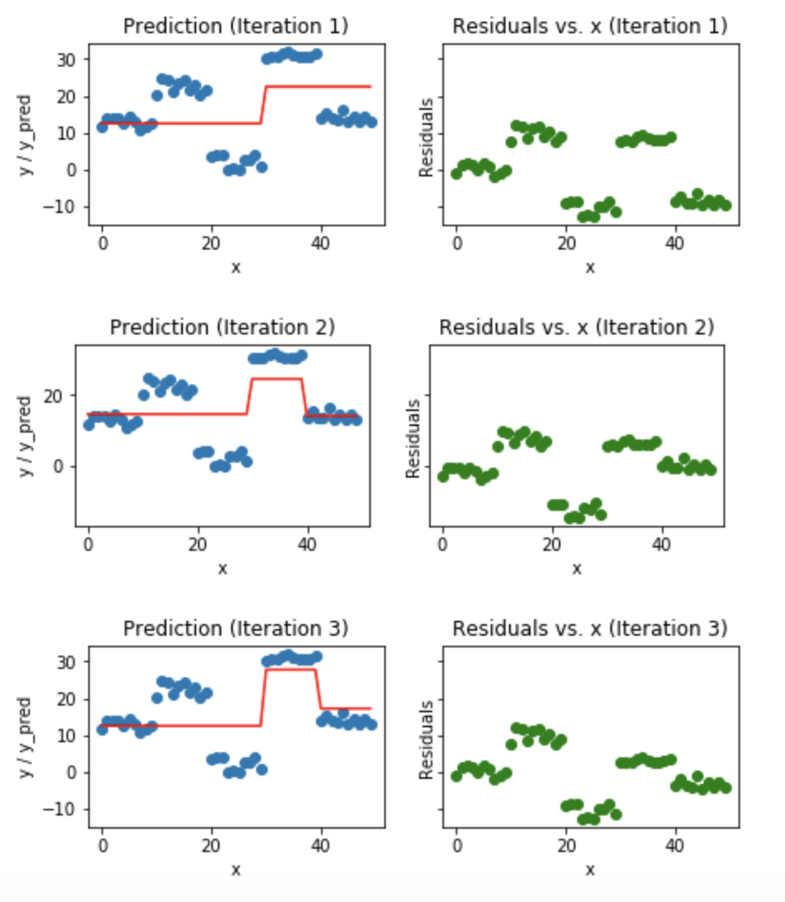

### Ensemble Methods Section 35

### Questions

### Objectives
YWBAT
- Compare and contrast decision trees with Random Forest Models
- Compare and contrast ADABoost with Gradient Boosting
- Condition our data for a single model
- Tune hyperparameters to increase desired metric
- Analyze model for use case
- Build a pipeline that will analyze an individual patient

### Outline
- Random Forests
- Adaboost and Gradient Boosted Random Forests
- Load in a dataset and try to solve the problem using Forest classifiers

### What is a random forest?
A random forest is a collection of decision trees where each decision tree is built by:
- random set of parameters
- similar tree hyperparameters 
    - maybe you can randomize each trees hyperparameters


How is a point assigned a label in a random forest?
- Each decision tree assigns a point a label
- The labels are then counted and the max count wins


### Pros and Cons
Pros
- Interpretability
    - you can interpret individual trees
    - strong performance
    - random sampling of features to reduce impact of strong features
        - prevents overfitting 
    - useful for datasets with high dimensionality of features
        - each tree is now reduced to a smaller dimension
        - you might miss important feature signals
    - good for small sample sizes because of bootstrap aggregation
        - more resilient to high variance

Cons
- Computationally expensive
- Greedy forests can occur if you sample too many features from your feature set on each tree
- Tree depth can cause greediness


### Real Life Structures


### Analyze 

### Adaboosting - sampling
* Adaptive Boosting
    * Weak Learners are adapting to previously misclassified data
* We're building a complex tree using stumps which are trees with 1 feature and 1 split
    


### Gradient boosting - residuals
* Building trees that fit on the residuals



### to use XGBOOST use
```import os
os.environ['KMP_DUPLICATE_LIB_OK']='True'```

### Outline


```python
import pandas as pd
import numpy as np

from sklearn.ensemble import RandomForestClassifier, AdaBoostClassifier, GradientBoostingClassifier
from sklearn.model_selection import train_test_split
from sklearn.feature_selection import SelectKBest
from sklearn.metrics import confusion_matrix, classification_report
from sklearn.preprocessing import StandardScaler

from mlxtend.feature_selection import SequentialFeatureSelector as sfs

import matplotlib.pyplot as plt
import seaborn as sns

np.random.seed(42)
```

### Let's build some models


```python
df = pd.read_csv("./churn.csv")
df.head()
```


<div>
<style scoped>
    .dataframe tbody tr th:only-of-type {
        vertical-align: middle;
    }

    .dataframe tbody tr th {
        vertical-align: top;
    }

    .dataframe thead th {
        text-align: right;
    }
</style>
<table border="1" class="dataframe">
  <thead>
    <tr style="text-align: right;">
      <th></th>
      <th>state</th>
      <th>account_length</th>
      <th>area_code</th>
      <th>phone_number</th>
      <th>international_plan</th>
      <th>voice_mail_plan</th>
      <th>number_vmail_messages</th>
      <th>total_day_minutes</th>
      <th>total_day_calls</th>
      <th>total_day_charge</th>
      <th>...</th>
      <th>total_eve_calls</th>
      <th>total_eve_charge</th>
      <th>total_night_minutes</th>
      <th>total_night_calls</th>
      <th>total_night_charge</th>
      <th>total_intl_minutes</th>
      <th>total_intl_calls</th>
      <th>total_intl_charge</th>
      <th>number_customer_service_calls</th>
      <th>class</th>
    </tr>
  </thead>
  <tbody>
    <tr>
      <td>0</td>
      <td>16</td>
      <td>128</td>
      <td>415</td>
      <td>2845</td>
      <td>0</td>
      <td>1</td>
      <td>25</td>
      <td>265.1</td>
      <td>110</td>
      <td>45.07</td>
      <td>...</td>
      <td>99</td>
      <td>16.78</td>
      <td>244.7</td>
      <td>91</td>
      <td>11.01</td>
      <td>10.0</td>
      <td>3</td>
      <td>2.70</td>
      <td>1</td>
      <td>0</td>
    </tr>
    <tr>
      <td>1</td>
      <td>35</td>
      <td>107</td>
      <td>415</td>
      <td>2301</td>
      <td>0</td>
      <td>1</td>
      <td>26</td>
      <td>161.6</td>
      <td>123</td>
      <td>27.47</td>
      <td>...</td>
      <td>103</td>
      <td>16.62</td>
      <td>254.4</td>
      <td>103</td>
      <td>11.45</td>
      <td>13.7</td>
      <td>3</td>
      <td>3.70</td>
      <td>1</td>
      <td>0</td>
    </tr>
    <tr>
      <td>2</td>
      <td>31</td>
      <td>137</td>
      <td>415</td>
      <td>1616</td>
      <td>0</td>
      <td>0</td>
      <td>0</td>
      <td>243.4</td>
      <td>114</td>
      <td>41.38</td>
      <td>...</td>
      <td>110</td>
      <td>10.30</td>
      <td>162.6</td>
      <td>104</td>
      <td>7.32</td>
      <td>12.2</td>
      <td>5</td>
      <td>3.29</td>
      <td>0</td>
      <td>0</td>
    </tr>
    <tr>
      <td>3</td>
      <td>35</td>
      <td>84</td>
      <td>408</td>
      <td>2510</td>
      <td>1</td>
      <td>0</td>
      <td>0</td>
      <td>299.4</td>
      <td>71</td>
      <td>50.90</td>
      <td>...</td>
      <td>88</td>
      <td>5.26</td>
      <td>196.9</td>
      <td>89</td>
      <td>8.86</td>
      <td>6.6</td>
      <td>7</td>
      <td>1.78</td>
      <td>2</td>
      <td>0</td>
    </tr>
    <tr>
      <td>4</td>
      <td>36</td>
      <td>75</td>
      <td>415</td>
      <td>155</td>
      <td>1</td>
      <td>0</td>
      <td>0</td>
      <td>166.7</td>
      <td>113</td>
      <td>28.34</td>
      <td>...</td>
      <td>122</td>
      <td>12.61</td>
      <td>186.9</td>
      <td>121</td>
      <td>8.41</td>
      <td>10.1</td>
      <td>3</td>
      <td>2.73</td>
      <td>3</td>
      <td>0</td>
    </tr>
  </tbody>
</table>
<p>5 rows × 21 columns</p>
</div>


```python
df.info()
```

    <class 'pandas.core.frame.DataFrame'>
    RangeIndex: 5000 entries, 0 to 4999
    Data columns (total 21 columns):
    state                            5000 non-null int64
    account_length                   5000 non-null int64
    area_code                        5000 non-null int64
    phone_number                     5000 non-null int64
    international_plan               5000 non-null int64
    voice_mail_plan                  5000 non-null int64
    number_vmail_messages            5000 non-null int64
    total_day_minutes                5000 non-null float64
    total_day_calls                  5000 non-null int64
    total_day_charge                 5000 non-null float64
    total_eve_minutes                5000 non-null float64
    total_eve_calls                  5000 non-null int64
    total_eve_charge                 5000 non-null float64
    total_night_minutes              5000 non-null float64
    total_night_calls                5000 non-null int64
    total_night_charge               5000 non-null float64
    total_intl_minutes               5000 non-null float64
    total_intl_calls                 5000 non-null int64
    total_intl_charge                5000 non-null float64
    number_customer_service_calls    5000 non-null int64
    class                            5000 non-null int64
    dtypes: float64(8), int64(13)
    memory usage: 820.4 KB


```python
df.isna().sum()
```


    state                            0
    account_length                   0
    area_code                        0
    phone_number                     0
    international_plan               0
    voice_mail_plan                  0
    number_vmail_messages            0
    total_day_minutes                0
    total_day_calls                  0
    total_day_charge                 0
    total_eve_minutes                0
    total_eve_calls                  0
    total_eve_charge                 0
    total_night_minutes              0
    total_night_calls                0
    total_night_charge               0
    total_intl_minutes               0
    total_intl_calls                 0
    total_intl_charge                0
    number_customer_service_calls    0
    class                            0
    dtype: int64


### Count your labels


```python
df["class"].value_counts()
```


    0    4293
    1     707
    Name: class, dtype: int64


### we have unbalanced data, which is bad


```python
df2 = df.drop(columns=["phone_number", "number_vmail_messages", "state", "area_code"])
df2.head()
```


<div>
<style scoped>
    .dataframe tbody tr th:only-of-type {
        vertical-align: middle;
    }

    .dataframe tbody tr th {
        vertical-align: top;
    }

    .dataframe thead th {
        text-align: right;
    }
</style>
<table border="1" class="dataframe">
  <thead>
    <tr style="text-align: right;">
      <th></th>
      <th>account_length</th>
      <th>international_plan</th>
      <th>voice_mail_plan</th>
      <th>total_day_minutes</th>
      <th>total_day_calls</th>
      <th>total_day_charge</th>
      <th>total_eve_minutes</th>
      <th>total_eve_calls</th>
      <th>total_eve_charge</th>
      <th>total_night_minutes</th>
      <th>total_night_calls</th>
      <th>total_night_charge</th>
      <th>total_intl_minutes</th>
      <th>total_intl_calls</th>
      <th>total_intl_charge</th>
      <th>number_customer_service_calls</th>
      <th>class</th>
    </tr>
  </thead>
  <tbody>
    <tr>
      <td>0</td>
      <td>128</td>
      <td>0</td>
      <td>1</td>
      <td>265.1</td>
      <td>110</td>
      <td>45.07</td>
      <td>197.4</td>
      <td>99</td>
      <td>16.78</td>
      <td>244.7</td>
      <td>91</td>
      <td>11.01</td>
      <td>10.0</td>
      <td>3</td>
      <td>2.70</td>
      <td>1</td>
      <td>0</td>
    </tr>
    <tr>
      <td>1</td>
      <td>107</td>
      <td>0</td>
      <td>1</td>
      <td>161.6</td>
      <td>123</td>
      <td>27.47</td>
      <td>195.5</td>
      <td>103</td>
      <td>16.62</td>
      <td>254.4</td>
      <td>103</td>
      <td>11.45</td>
      <td>13.7</td>
      <td>3</td>
      <td>3.70</td>
      <td>1</td>
      <td>0</td>
    </tr>
    <tr>
      <td>2</td>
      <td>137</td>
      <td>0</td>
      <td>0</td>
      <td>243.4</td>
      <td>114</td>
      <td>41.38</td>
      <td>121.2</td>
      <td>110</td>
      <td>10.30</td>
      <td>162.6</td>
      <td>104</td>
      <td>7.32</td>
      <td>12.2</td>
      <td>5</td>
      <td>3.29</td>
      <td>0</td>
      <td>0</td>
    </tr>
    <tr>
      <td>3</td>
      <td>84</td>
      <td>1</td>
      <td>0</td>
      <td>299.4</td>
      <td>71</td>
      <td>50.90</td>
      <td>61.9</td>
      <td>88</td>
      <td>5.26</td>
      <td>196.9</td>
      <td>89</td>
      <td>8.86</td>
      <td>6.6</td>
      <td>7</td>
      <td>1.78</td>
      <td>2</td>
      <td>0</td>
    </tr>
    <tr>
      <td>4</td>
      <td>75</td>
      <td>1</td>
      <td>0</td>
      <td>166.7</td>
      <td>113</td>
      <td>28.34</td>
      <td>148.3</td>
      <td>122</td>
      <td>12.61</td>
      <td>186.9</td>
      <td>121</td>
      <td>8.41</td>
      <td>10.1</td>
      <td>3</td>
      <td>2.73</td>
      <td>3</td>
      <td>0</td>
    </tr>
  </tbody>
</table>
</div>


```python
df2.corr()
```


<div>
<style scoped>
    .dataframe tbody tr th:only-of-type {
        vertical-align: middle;
    }

    .dataframe tbody tr th {
        vertical-align: top;
    }

    .dataframe thead th {
        text-align: right;
    }
</style>
<table border="1" class="dataframe">
  <thead>
    <tr style="text-align: right;">
      <th></th>
      <th>account_length</th>
      <th>international_plan</th>
      <th>voice_mail_plan</th>
      <th>total_day_minutes</th>
      <th>total_day_calls</th>
      <th>total_day_charge</th>
      <th>total_eve_minutes</th>
      <th>total_eve_calls</th>
      <th>total_eve_charge</th>
      <th>total_night_minutes</th>
      <th>total_night_calls</th>
      <th>total_night_charge</th>
      <th>total_intl_minutes</th>
      <th>total_intl_calls</th>
      <th>total_intl_charge</th>
      <th>number_customer_service_calls</th>
      <th>class</th>
    </tr>
  </thead>
  <tbody>
    <tr>
      <td>account_length</td>
      <td>1.000000</td>
      <td>0.014681</td>
      <td>-0.006650</td>
      <td>-0.001017</td>
      <td>0.028240</td>
      <td>-0.001019</td>
      <td>-0.009591</td>
      <td>0.009143</td>
      <td>-0.009587</td>
      <td>0.000668</td>
      <td>-0.007825</td>
      <td>0.000656</td>
      <td>0.001291</td>
      <td>0.014277</td>
      <td>0.001292</td>
      <td>-0.001445</td>
      <td>0.021203</td>
    </tr>
    <tr>
      <td>international_plan</td>
      <td>0.014681</td>
      <td>1.000000</td>
      <td>0.009054</td>
      <td>0.028138</td>
      <td>0.008102</td>
      <td>0.028141</td>
      <td>0.021235</td>
      <td>0.002505</td>
      <td>0.021234</td>
      <td>-0.026508</td>
      <td>0.005623</td>
      <td>-0.026510</td>
      <td>0.031799</td>
      <td>0.004493</td>
      <td>0.031751</td>
      <td>-0.012974</td>
      <td>0.259123</td>
    </tr>
    <tr>
      <td>voice_mail_plan</td>
      <td>-0.006650</td>
      <td>0.009054</td>
      <td>1.000000</td>
      <td>0.002059</td>
      <td>-0.001735</td>
      <td>0.002056</td>
      <td>0.023328</td>
      <td>-0.005916</td>
      <td>0.023332</td>
      <td>0.005524</td>
      <td>0.009176</td>
      <td>0.005522</td>
      <td>0.004116</td>
      <td>-0.007525</td>
      <td>0.004165</td>
      <td>-0.014453</td>
      <td>-0.110698</td>
    </tr>
    <tr>
      <td>total_day_minutes</td>
      <td>-0.001017</td>
      <td>0.028138</td>
      <td>0.002059</td>
      <td>1.000000</td>
      <td>0.001935</td>
      <td>1.000000</td>
      <td>-0.010750</td>
      <td>0.008128</td>
      <td>-0.010760</td>
      <td>0.011799</td>
      <td>0.004236</td>
      <td>0.011783</td>
      <td>-0.019486</td>
      <td>-0.001303</td>
      <td>-0.019415</td>
      <td>0.002733</td>
      <td>0.207705</td>
    </tr>
    <tr>
      <td>total_day_calls</td>
      <td>0.028240</td>
      <td>0.008102</td>
      <td>-0.001735</td>
      <td>0.001935</td>
      <td>1.000000</td>
      <td>0.001936</td>
      <td>-0.000699</td>
      <td>0.003754</td>
      <td>-0.000695</td>
      <td>0.002804</td>
      <td>-0.008308</td>
      <td>0.002802</td>
      <td>0.013097</td>
      <td>0.010893</td>
      <td>0.013161</td>
      <td>-0.010739</td>
      <td>0.016130</td>
    </tr>
    <tr>
      <td>total_day_charge</td>
      <td>-0.001019</td>
      <td>0.028141</td>
      <td>0.002056</td>
      <td>1.000000</td>
      <td>0.001936</td>
      <td>1.000000</td>
      <td>-0.010747</td>
      <td>0.008129</td>
      <td>-0.010757</td>
      <td>0.011801</td>
      <td>0.004235</td>
      <td>0.011785</td>
      <td>-0.019490</td>
      <td>-0.001307</td>
      <td>-0.019419</td>
      <td>0.002726</td>
      <td>0.207700</td>
    </tr>
    <tr>
      <td>total_eve_minutes</td>
      <td>-0.009591</td>
      <td>0.021235</td>
      <td>0.023328</td>
      <td>-0.010750</td>
      <td>-0.000699</td>
      <td>-0.010747</td>
      <td>1.000000</td>
      <td>0.002763</td>
      <td>1.000000</td>
      <td>-0.016639</td>
      <td>0.013420</td>
      <td>-0.016642</td>
      <td>0.000137</td>
      <td>0.008388</td>
      <td>0.000159</td>
      <td>-0.013823</td>
      <td>0.089288</td>
    </tr>
    <tr>
      <td>total_eve_calls</td>
      <td>0.009143</td>
      <td>0.002505</td>
      <td>-0.005916</td>
      <td>0.008128</td>
      <td>0.003754</td>
      <td>0.008129</td>
      <td>0.002763</td>
      <td>1.000000</td>
      <td>0.002778</td>
      <td>0.001781</td>
      <td>-0.013682</td>
      <td>0.001799</td>
      <td>-0.007458</td>
      <td>0.005574</td>
      <td>-0.007507</td>
      <td>0.006235</td>
      <td>-0.006284</td>
    </tr>
    <tr>
      <td>total_eve_charge</td>
      <td>-0.009587</td>
      <td>0.021234</td>
      <td>0.023332</td>
      <td>-0.010760</td>
      <td>-0.000695</td>
      <td>-0.010757</td>
      <td>1.000000</td>
      <td>0.002778</td>
      <td>1.000000</td>
      <td>-0.016649</td>
      <td>0.013422</td>
      <td>-0.016652</td>
      <td>0.000132</td>
      <td>0.008393</td>
      <td>0.000155</td>
      <td>-0.013836</td>
      <td>0.089282</td>
    </tr>
    <tr>
      <td>total_night_minutes</td>
      <td>0.000668</td>
      <td>-0.026508</td>
      <td>0.005524</td>
      <td>0.011799</td>
      <td>0.002804</td>
      <td>0.011801</td>
      <td>-0.016639</td>
      <td>0.001781</td>
      <td>-0.016649</td>
      <td>1.000000</td>
      <td>0.026972</td>
      <td>0.999999</td>
      <td>-0.006721</td>
      <td>-0.017214</td>
      <td>-0.006655</td>
      <td>-0.008533</td>
      <td>0.045677</td>
    </tr>
    <tr>
      <td>total_night_calls</td>
      <td>-0.007825</td>
      <td>0.005623</td>
      <td>0.009176</td>
      <td>0.004236</td>
      <td>-0.008308</td>
      <td>0.004235</td>
      <td>0.013420</td>
      <td>-0.013682</td>
      <td>0.013422</td>
      <td>0.026972</td>
      <td>1.000000</td>
      <td>0.026949</td>
      <td>0.000391</td>
      <td>-0.000156</td>
      <td>0.000368</td>
      <td>-0.008283</td>
      <td>-0.006986</td>
    </tr>
    <tr>
      <td>total_night_charge</td>
      <td>0.000656</td>
      <td>-0.026510</td>
      <td>0.005522</td>
      <td>0.011783</td>
      <td>0.002802</td>
      <td>0.011785</td>
      <td>-0.016642</td>
      <td>0.001799</td>
      <td>-0.016652</td>
      <td>0.999999</td>
      <td>0.026949</td>
      <td>1.000000</td>
      <td>-0.006717</td>
      <td>-0.017182</td>
      <td>-0.006650</td>
      <td>-0.008530</td>
      <td>0.045673</td>
    </tr>
    <tr>
      <td>total_intl_minutes</td>
      <td>0.001291</td>
      <td>0.031799</td>
      <td>0.004116</td>
      <td>-0.019486</td>
      <td>0.013097</td>
      <td>-0.019490</td>
      <td>0.000137</td>
      <td>-0.007458</td>
      <td>0.000132</td>
      <td>-0.006721</td>
      <td>0.000391</td>
      <td>-0.006717</td>
      <td>1.000000</td>
      <td>0.016791</td>
      <td>0.999993</td>
      <td>-0.012122</td>
      <td>0.063285</td>
    </tr>
    <tr>
      <td>total_intl_calls</td>
      <td>0.014277</td>
      <td>0.004493</td>
      <td>-0.007525</td>
      <td>-0.001303</td>
      <td>0.010893</td>
      <td>-0.001307</td>
      <td>0.008388</td>
      <td>0.005574</td>
      <td>0.008393</td>
      <td>-0.017214</td>
      <td>-0.000156</td>
      <td>-0.017182</td>
      <td>0.016791</td>
      <td>1.000000</td>
      <td>0.016900</td>
      <td>-0.019147</td>
      <td>-0.046893</td>
    </tr>
    <tr>
      <td>total_intl_charge</td>
      <td>0.001292</td>
      <td>0.031751</td>
      <td>0.004165</td>
      <td>-0.019415</td>
      <td>0.013161</td>
      <td>-0.019419</td>
      <td>0.000159</td>
      <td>-0.007507</td>
      <td>0.000155</td>
      <td>-0.006655</td>
      <td>0.000368</td>
      <td>-0.006650</td>
      <td>0.999993</td>
      <td>0.016900</td>
      <td>1.000000</td>
      <td>-0.012180</td>
      <td>0.063275</td>
    </tr>
    <tr>
      <td>number_customer_service_calls</td>
      <td>-0.001445</td>
      <td>-0.012974</td>
      <td>-0.014453</td>
      <td>0.002733</td>
      <td>-0.010739</td>
      <td>0.002726</td>
      <td>-0.013823</td>
      <td>0.006235</td>
      <td>-0.013836</td>
      <td>-0.008533</td>
      <td>-0.008283</td>
      <td>-0.008530</td>
      <td>-0.012122</td>
      <td>-0.019147</td>
      <td>-0.012180</td>
      <td>1.000000</td>
      <td>0.212564</td>
    </tr>
    <tr>
      <td>class</td>
      <td>0.021203</td>
      <td>0.259123</td>
      <td>-0.110698</td>
      <td>0.207705</td>
      <td>0.016130</td>
      <td>0.207700</td>
      <td>0.089288</td>
      <td>-0.006284</td>
      <td>0.089282</td>
      <td>0.045677</td>
      <td>-0.006986</td>
      <td>0.045673</td>
      <td>0.063285</td>
      <td>-0.046893</td>
      <td>0.063275</td>
      <td>0.212564</td>
      <td>1.000000</td>
    </tr>
  </tbody>
</table>
</div>


### Let's build a out of box random forest


```python
clf = RandomForestClassifier(criterion='entropy', max_depth=5)
```


```python
X, y = df2.drop("class", axis=1), df["class"]
```


```python
xtrain, xtest, ytrain, ytest = train_test_split(X, y, train_size=0.70)
```


```python
clf.fit(xtrain, ytrain)
```


    RandomForestClassifier(bootstrap=True, ccp_alpha=0.0, class_weight=None,
                           criterion='entropy', max_depth=5, max_features='auto',
                           max_leaf_nodes=None, max_samples=None,
                           min_impurity_decrease=0.0, min_impurity_split=None,
                           min_samples_leaf=1, min_samples_split=2,
                           min_weight_fraction_leaf=0.0, n_estimators=100,
                           n_jobs=None, oob_score=False, random_state=None,
                           verbose=0, warm_start=False)


```python
clf.score(xtest, ytest)
```


    0.9273333333333333


```python
ytest_preds = clf.predict(xtest)
```


```python
confusion_matrix(ytest, ytest_preds)
```


    array([[1300,    4],
           [ 105,   91]])


### How do we deal with imbalanced data? 


```python
from imblearn.over_sampling import SMOTE
```


```python
smote = SMOTE()
```


```python
xtrain_smote, ytrain_smote = smote.fit_resample(xtrain, ytrain)
```

    /Users/rafael/anaconda3/envs/flatiron-env/lib/python3.6/site-packages/sklearn/utils/deprecation.py:87: FutureWarning: Function safe_indexing is deprecated; safe_indexing is deprecated in version 0.22 and will be removed in version 0.24.
      warnings.warn(msg, category=FutureWarning)


```python
xtrain.shape, xtrain_smote.shape
```


    ((3500, 16), (5978, 16))


```python
np.bincount(ytrain), np.bincount(ytrain_smote)
```


    (array([2989,  511]), array([2989, 2989]))


### Now that that's over...let's make a random forest on our synthesized data


```python
clf = RandomForestClassifier(n_estimators=20, criterion='entropy', max_depth=4)
clf.fit(xtrain_smote, ytrain_smote)
```


    RandomForestClassifier(bootstrap=True, ccp_alpha=0.0, class_weight=None,
                           criterion='entropy', max_depth=4, max_features='auto',
                           max_leaf_nodes=None, max_samples=None,
                           min_impurity_decrease=0.0, min_impurity_split=None,
                           min_samples_leaf=1, min_samples_split=2,
                           min_weight_fraction_leaf=0.0, n_estimators=20,
                           n_jobs=None, oob_score=False, random_state=None,
                           verbose=0, warm_start=False)


```python
clf.score(xtest, ytest)

ytest_preds = clf.predict(xtest)
```


```python
confusion_matrix(ytest, ytest_preds)
```


    array([[1174,  130],
           [  36,  160]])


### Now let's look at feature importances in our model


```python
feature_scores = clf.feature_importances_
features = xtrain.columns
```


```python
plt.figure(figsize=(8, 5))
plt.grid()
plt.bar(features, feature_scores)
plt.xticks(rotation=75)
plt.show()
```


```python
df2['ones'] = np.ones(shape=(df.shape[0], 1))
df2.head()
```


<div>
<style scoped>
    .dataframe tbody tr th:only-of-type {
        vertical-align: middle;
    }

    .dataframe tbody tr th {
        vertical-align: top;
    }

    .dataframe thead th {
        text-align: right;
    }
</style>
<table border="1" class="dataframe">
  <thead>
    <tr style="text-align: right;">
      <th></th>
      <th>account_length</th>
      <th>international_plan</th>
      <th>voice_mail_plan</th>
      <th>total_day_minutes</th>
      <th>total_day_calls</th>
      <th>total_day_charge</th>
      <th>total_eve_minutes</th>
      <th>total_eve_calls</th>
      <th>total_eve_charge</th>
      <th>total_night_minutes</th>
      <th>total_night_calls</th>
      <th>total_night_charge</th>
      <th>total_intl_minutes</th>
      <th>total_intl_calls</th>
      <th>total_intl_charge</th>
      <th>number_customer_service_calls</th>
      <th>class</th>
      <th>ones</th>
    </tr>
  </thead>
  <tbody>
    <tr>
      <td>0</td>
      <td>128</td>
      <td>0</td>
      <td>1</td>
      <td>265.1</td>
      <td>110</td>
      <td>45.07</td>
      <td>197.4</td>
      <td>99</td>
      <td>16.78</td>
      <td>244.7</td>
      <td>91</td>
      <td>11.01</td>
      <td>10.0</td>
      <td>3</td>
      <td>2.70</td>
      <td>1</td>
      <td>0</td>
      <td>1.0</td>
    </tr>
    <tr>
      <td>1</td>
      <td>107</td>
      <td>0</td>
      <td>1</td>
      <td>161.6</td>
      <td>123</td>
      <td>27.47</td>
      <td>195.5</td>
      <td>103</td>
      <td>16.62</td>
      <td>254.4</td>
      <td>103</td>
      <td>11.45</td>
      <td>13.7</td>
      <td>3</td>
      <td>3.70</td>
      <td>1</td>
      <td>0</td>
      <td>1.0</td>
    </tr>
    <tr>
      <td>2</td>
      <td>137</td>
      <td>0</td>
      <td>0</td>
      <td>243.4</td>
      <td>114</td>
      <td>41.38</td>
      <td>121.2</td>
      <td>110</td>
      <td>10.30</td>
      <td>162.6</td>
      <td>104</td>
      <td>7.32</td>
      <td>12.2</td>
      <td>5</td>
      <td>3.29</td>
      <td>0</td>
      <td>0</td>
      <td>1.0</td>
    </tr>
    <tr>
      <td>3</td>
      <td>84</td>
      <td>1</td>
      <td>0</td>
      <td>299.4</td>
      <td>71</td>
      <td>50.90</td>
      <td>61.9</td>
      <td>88</td>
      <td>5.26</td>
      <td>196.9</td>
      <td>89</td>
      <td>8.86</td>
      <td>6.6</td>
      <td>7</td>
      <td>1.78</td>
      <td>2</td>
      <td>0</td>
      <td>1.0</td>
    </tr>
    <tr>
      <td>4</td>
      <td>75</td>
      <td>1</td>
      <td>0</td>
      <td>166.7</td>
      <td>113</td>
      <td>28.34</td>
      <td>148.3</td>
      <td>122</td>
      <td>12.61</td>
      <td>186.9</td>
      <td>121</td>
      <td>8.41</td>
      <td>10.1</td>
      <td>3</td>
      <td>2.73</td>
      <td>3</td>
      <td>0</td>
      <td>1.0</td>
    </tr>
  </tbody>
</table>
</div>


```python
sns.catplot(x='class', hue='international_plan', kind='count', data=df2)
plt.show()
```


### how do we look at a tree? 


```python
tree0 = clf.estimators_[12]
```


```python
from sklearn.externals.six import StringIO  
from IPython.display import Image  
from sklearn.tree import export_graphviz
from sklearn.metrics import accuracy_score
import pydotplus
```


```python
dot_data = StringIO()
export_graphviz(tree0, out_file=dot_data,  
                filled=True, rounded=True,
                special_characters=True)
graph = pydotplus.graph_from_dot_data(dot_data.getvalue())  
Image(graph.create_png())
```


```python
clf = AdaBoostClassifier(n_estimators=20)
```


```python
clf.fit(xtrain_smote, ytrain_smote)
clf.score(xtest, ytest)
```


    0.8753333333333333


```python
confusion_matrix(ytest, clf.predict(xtest))
```


    array([[1172,  132],
           [  55,  141]])


```python
clf = GradientBoostingClassifier(learning_rate=1.0, n_estimators=20)
clf.fit(xtrain_smote, ytrain_smote)
print(clf.score(xtest, ytest))
confusion_matrix(ytest, clf.predict(xtest))
```

    0.9426666666666667


    array([[1263,   41],
           [  45,  151]])


```python
tree0 = clf.estimators_[0][0]
dot_data = StringIO()
export_graphviz(tree0, out_file=dot_data,  
                filled=True, rounded=True,
                special_characters=True)
graph = pydotplus.graph_from_dot_data(dot_data.getvalue())  
Image(graph.create_png())
```


```python
tree0
```


    DecisionTreeRegressor(ccp_alpha=0.0, criterion='friedman_mse', max_depth=3,
                          max_features=None, max_leaf_nodes=None,
                          min_impurity_decrease=0.0, min_impurity_split=None,
                          min_samples_leaf=1, min_samples_split=2,
                          min_weight_fraction_leaf=0.0, presort='deprecated',
                          random_state=<mtrand.RandomState object at 0x10e0b4798>,
                          splitter='best')


```python

```
